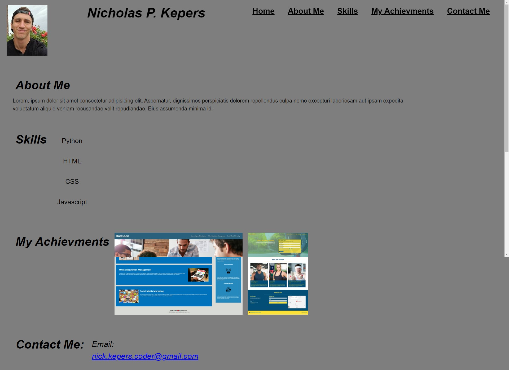

# My-Portfolio

# Create Layout

HTML - 
    Design an HTML page with semantic elements.
    Create layout with an about me section, skills, achievments, and how to contact me.

CSS -
    Make sure code is condensed and organized with comments.

## My Portolfio
[Web Link](https://nkepers.github.io/My-Portfolio/ "My-Portfolio")

## Details

This is how it should look when displayed on your device.
    

## Credit
This couldn't have been accomplished without their help!
[University of Arizona Coding Bootcamp](https://courses.bootcamp.com "UofA")